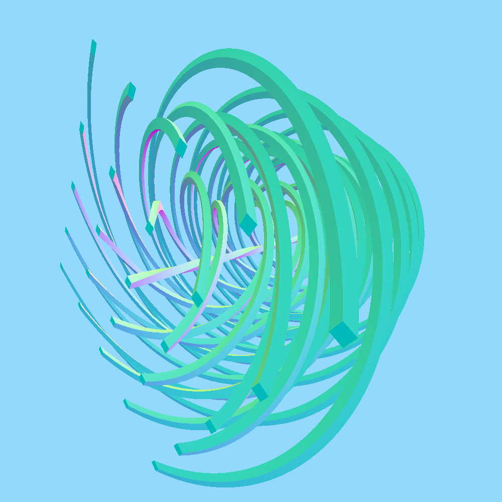

## The structure of the file


## Error: `rapidjson internal assertion failure: IsObject()`

This means that one of your parameters isn't specified in valid JSON: maybe you are missing a `,`, a `}`, or you have a `,` after the last value of your parameter? It might also be that floats need to have a decimal part: `0.` is not valid but `0.0` is.

## Parameter names

You can put spaces and `-` in the names of your parameters; just know that you have to replace them with an `_` when using your parameter in your function body. For example if you have this parameter:
```json
float {
    "Name": "My Amazing Radius",
    "Default": 1.0,
    "Min": 0.0,
    "Max": 10.0
}
```

then it will be used as `My_Amazing_Radius`:
```glsl
[] (vec3 pos) {
    return length(pos) - My_Amazing_Radius;
}
```

## Available functions 
 
TODO List all functions available in math.glsl, hg_sdf.glsl etc. 

## Fixing artifacts

Some nodes might not be perfect euclidian distance fields. In such cases visual artifacts can appear:


To fix them, simply wrap your return statement.s with `IS0_FIX_ARTIFACTS()`:
```glsl
return IS0_FIX_ARTIFACTS(${SDF}(q)); 
```

It will add a `Fix Artifacts` parameter to your nodes.

**N.B.** Always remember that `Fix Artifacts` slows down the rendering when set to too high values. Users should always try to keep it as small as possible, and only increase it when they need to fix some visual artifacts.

