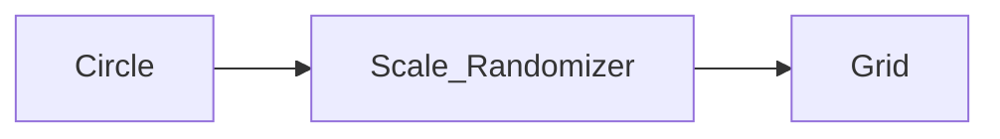
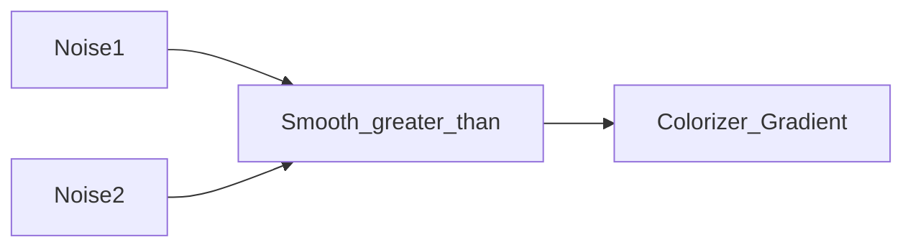

Each `Node` defines a function. We can then generate by-products functions with the desired signature that use that base function.
For example, if a Node defines a Color->Color function (called `f`), but we want a UV->Color function (`g`), we can define it as:

```glsl
INPUT Image image;

Color g(UV uv)
{
    return f(image(uv));
}
```

This means that the node needs another node as input, which will have to generate an Image too (aka UV->Color function).

Actually signatures don't need to take list of things, one input type and one out is enough?. I don't see many use cases for multi input functions (for example a blend is not a 2 param function, it is an image, it has only one paral. The two images are INPUTs, but the synthesized function only has one param (a UV)). One case would be creating a color from 3 floats. But I think we can just reuse the one to one case three times (aka, we want to create an Image from a (float, float, float) -> Color. We would want to take three UV->float functions and then generate the corresponding UV->Color function. But if we just asked to convert float->Color, we would also get a request for a UV->float function (if we disable the implicit conversion from float to UV).)

A node can define multiple functions (aka have two output pins). For example a UV grid creates both a UV->UV function (fract) and also a UV->ivec2 function (floor). Its nice to have them in the same node so they can share params (like number of cells).

This generalized system will also solve problems in is0 like the fact that I want the repeat to be able to randomize the SDF of each cell. Now we can take a second Input that is a (SDF, ivec3)->SDF node.

BETTER IDEA for the grid randomization. A grid takes UVs and returns (UV, InstanceId2D). This will be turned into a node that takes one function (UV, InstanceId2D) -> ? and returns a function UV -> ?.
A function UV->Color can be turned into (UV, InstanceId2D)-> Color easily by just ignoring the InstanceId2D. And we can create randomizer and other effects that modify each instance. For example scale randomizer takes an image as input and creates a (UV, InstanceId2D)-> Color function by doing
```glsl
float rand = random(instance_id_2D);
return image(uv * rand);
```
This function is the same as the input image (maybe scaled differently), except that when instanced, each instance will have a different scale.

This graph gives a grid of circles with random scales:


## Examples

### Color splashes



`Smooth_greater_than` returns 0 or 1 depending on which input is greater (with a quick continuous transition from 0 to 1 when the two inputs are approximately equal)

**?** How do we generalize that to three noises? We need a "greater than" that returns 0, 0.5 or 1 (Notice that we don't return integers but fractions, because we love the [0, 1] range) depending on which input is greatest.

And instead of choosing the greater one, we can also choose the middle one or the smallest one. It should give quite different shapes, especially the middle one.