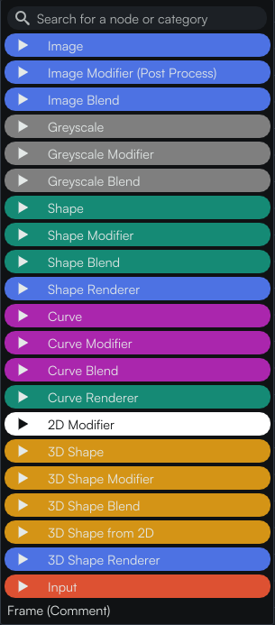
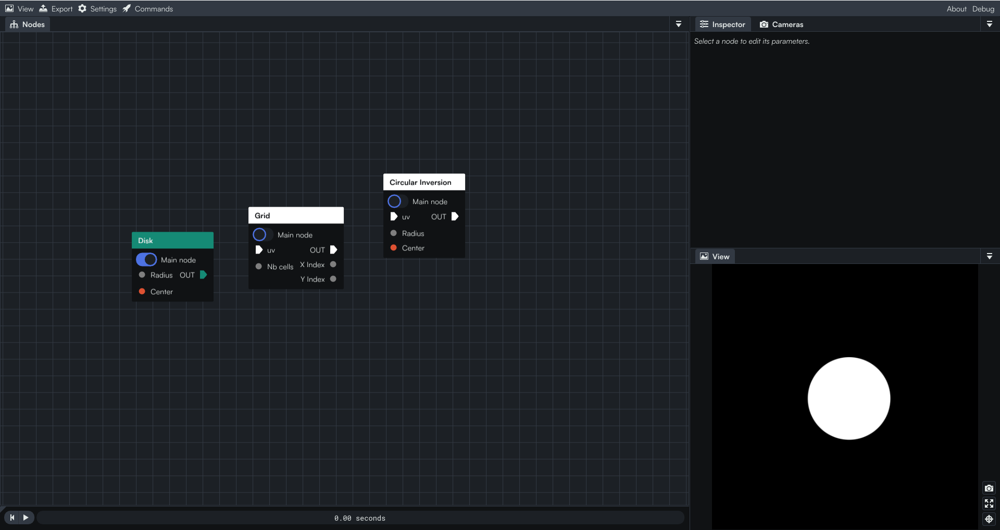

# Interface

## Summary
In this tutorial, we will have an overview of the different main sections that make up the interface of Coollab.

## Exploring the interface

This pop-up window will show after the launch. You can close it by clicking the `Got it!` button or by clicking the cross in the upper right corner. If you wish to retrieve all of the tips, such as shortcuts, click on the appropriate button. You may find the tips in the menu bar, in the commands area, symbolized by the rocket icon.

Nice progress! Now you should now have the main interface in front of you.

Coollab's interface is broken up into several main sections:

- `Nodes panel`: A place to add your nodes and link them together.
- `Inspector`: Displays information on the selected node.
- `Camera`: Displays information on the camera and its parameters
- `View`: The render view of your scene.
- `Time`: Displays the time in seconds.

Because there is a dock system, you can rearrange them whenever you want. Simply move the window wherever you wish, if you have another display such as a second monitor, you can drag them there as well. If you only want a floating window, you can temporarily disable docking by pressing `Shift`.

## Add nodes in the graph

Let’s jump right inside the **node** graph panel. It is at that location that we will be adding all the nodes and eventually have our project structure. As you can see, you can scroll in and out with your mouse to adjust the zoom inside this window. When you right-click then drag your mouse all over, you can easily navigate through the node graph in order to have a better view or to reorganize your nodes blocks. If you are lost, you can press **F** and it will automatically recenter the view on the nodes.

Now, let’s add our first node to show you how the panel works. To add a node, simply right-click inside the node workspace, then you will see a colored list, corresponding to a specific type of node. Let’s start simple by adding a simple shape. Note that you can also press **A** on your keyboard to display the node menu.

## Analyzing the node structure

As you can see, a node is generally represented as follows and generally works on their own but there are exceptions such as modifiers and blend, we will talk about them later. It consists of one, severals or even none input. The output is always represented with this triangular shape pointing to the right with the word `OUT`.

The `Main node` status actually tells you which node is displayed on the viewport. Let’s show you this feature, if for example we add another node, we can switch between them which can be useful if you wanna see the different steps when you would have a more complex node graph.

Now, the idea is to combine and link node together. Just select the node you want, then click on either an input or output and drag it out of the node to create a link. You can then connect it to another node. However, if you release it in a blank area, it will display the node menu again. Add one and it will  get attached automatically to the other node.

If you want to break the link, just select the rope and press the **Delete** key on your keyboard.

That’s pretty much all for today’s tutorial! You can already go a little further and try to add nodes by yourself in order to get more familiar with the node panel! 👋

