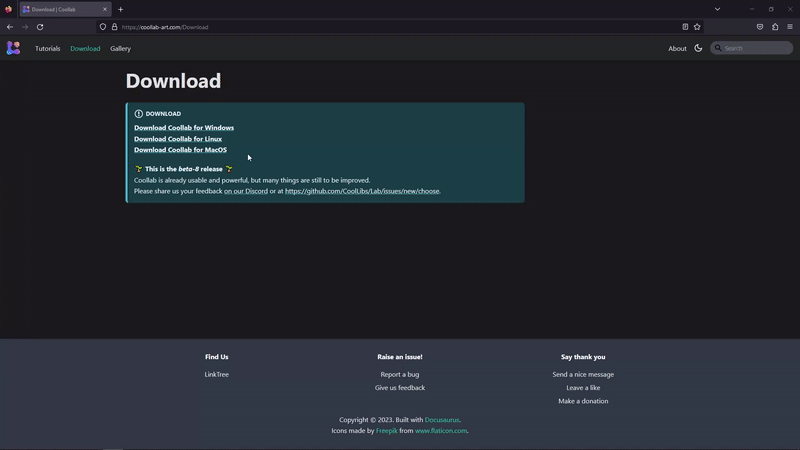
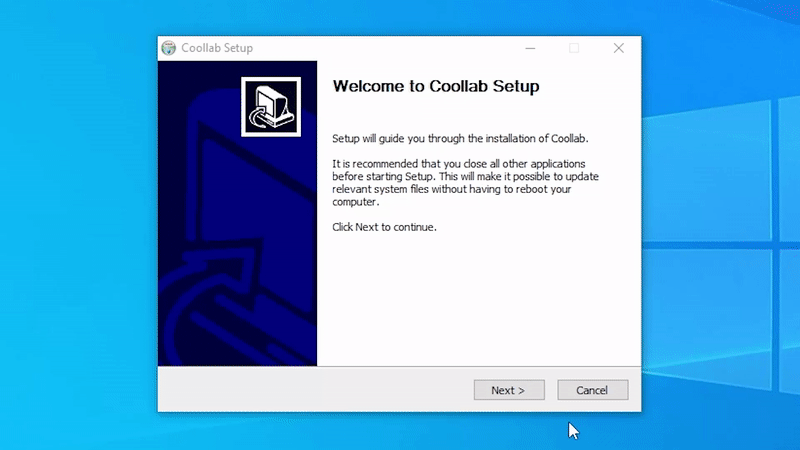
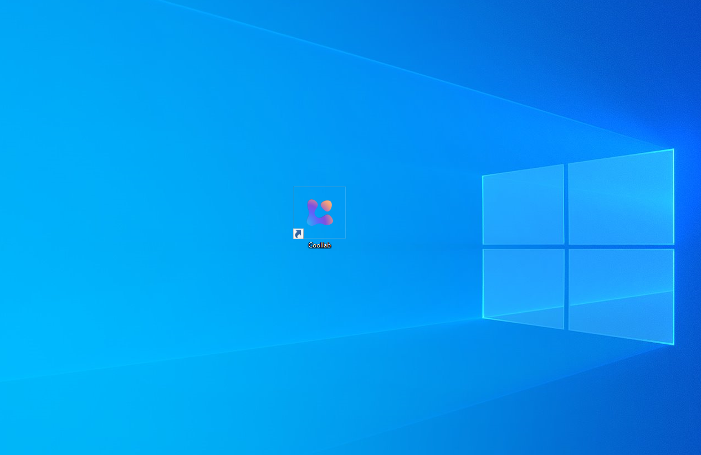

import YoutubeVideo from "@site/src/components/YoutubeVideo"

# Installation

<YoutubeVideo id="swMZGsGje4E "/>
 
Welcome to the installation tutorial of Coollab.

## Summary

Today we will see where to get the Coollab software and how to install it on our machine.

Let’s get started!

## Download from the website

First and foremost, we will download and install the software on the machine.

After opening our browser, we will visit this link: [Download Coollab](https://coollab-art.com/Download).  We are taken to the `Download` page of Coollab.

As you can see, we have different links depending on the platform we are working on. Click the one that suits your operating system. In our case, we work on **Windows**, we will get an executable installer.

## Installer

Now that we obtained the Coollab installer, it is time to execute it. We have to follow the setup through this installer in order to install Coollab.  First, we will have to agree to the **GNU GENERAL PUBLIC LICENSE**. Then it will ask for the folder in which to install Coollab, here it is up to you!
If we want to create a **Start Menu folder,** we can keep the `Do not create shortcuts` unchecked, then click on the `Install` button. When it is done you can click on `Finish` to close the setup.

## End of the installation

And here we go! We successfully installed Coollab on our machine, it was very simple!
We can create a shortcut on our **Desktop** for all practical purposes ✨

This is the end of the installation process! Now you can open the software and continue with the next tutorial! 👋 