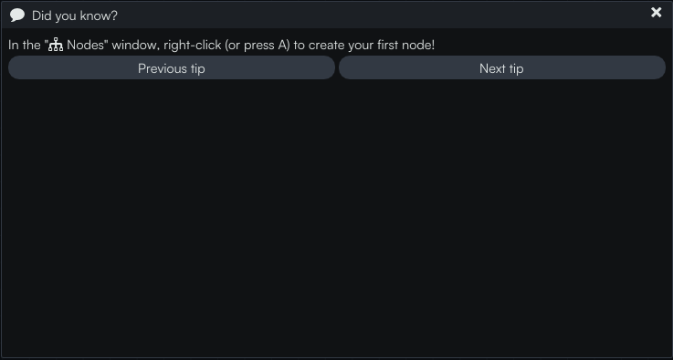
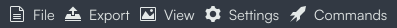
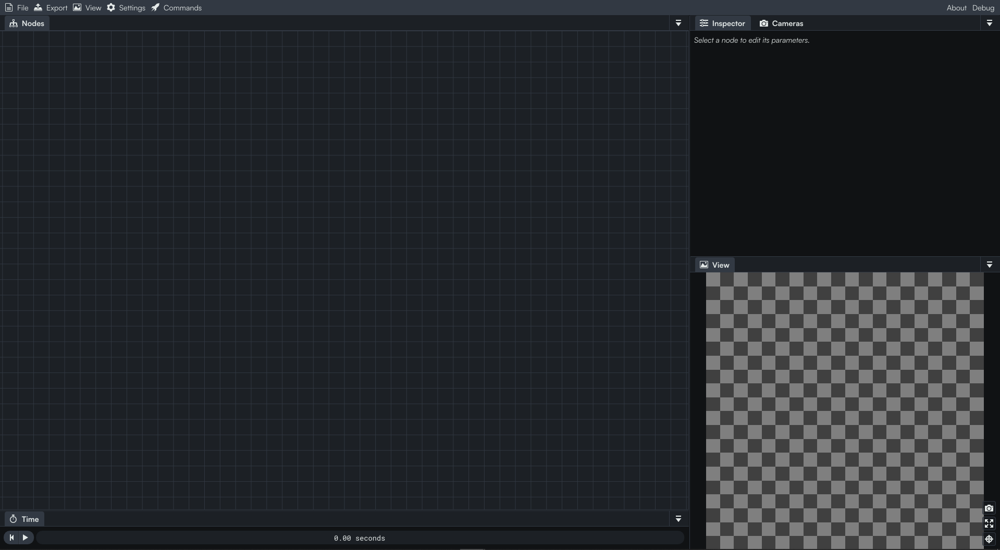
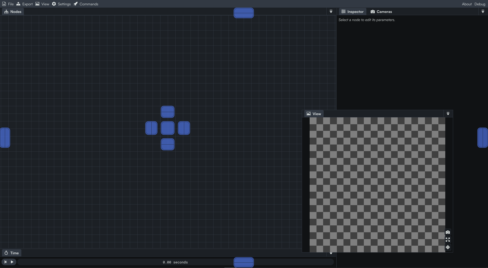
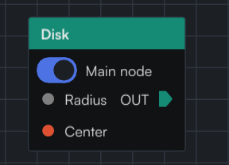
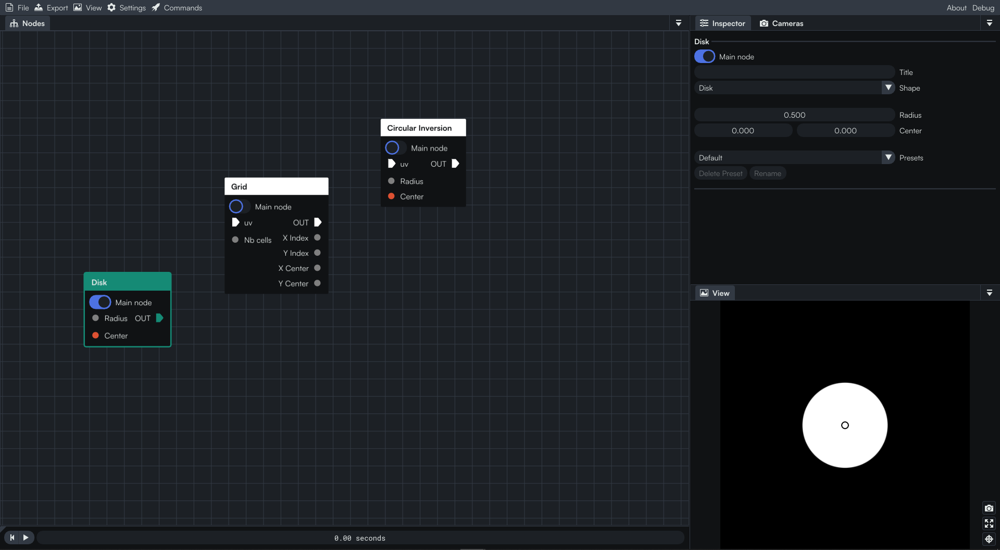
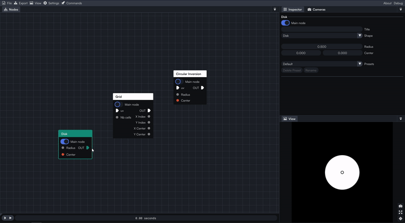

import YoutubeVideo from "@site/src/components/YoutubeVideo"

<YoutubeVideo id="FK1sMPgcE4Q"/>
 

In this tutorial we will take an overview of the different main sections that make up the Coollab interface.

## Exploring the interface

After opening Coollab, this pop-up window will appear:  `Did you know?`. You can close it by pressing <kbd>ESCAPE</kbd>.

If you want to see all the tips you can find them in the  `Commands` menu.

Nice progress! You now we have the main interface in front of you.

Coollab's interface is broken up into several sections:

- |  `Nodes`: A place to add your nodes and link them together.
- |  `Inspector`: Edit parameters of the selected node.
- |  `Camera`: Edit parameters of the camera.
- |  `View`: The rendered view of your scene.
- |  `Time`: Displays the time in seconds.

It is good to know that you can rearrange these panels however you want. If you have a second monitor, you can drag them there as well.

## The nodes panel

### Navigating

Let’s jump in the  `Nodes` panel. This is where you will add all your nodes. As you can see, you can zoom in and out with your mouse wheel, and use right-click and drag to move the view around.

:::tip
If you lost your nodes you can press <kbd>F</kbd> and it will automatically center the view on them.
:::

### Adding nodes

Now let’s add our first node to show how the panel works. To add a node, simply right-click or press <kbd>A</kbd> inside the nodes workspace: you will see the list of all the nodes appear. Let’s start by adding a simple `Shape`.

## Inspecting a node

As you can see, a node is represented as follows. It consists of one, several or even no inputs. The output is always represented with this triangular shape.

The `Main node` toggle tells you which node is displayed in the viewport. If for example you add another node, you can switch between them and choose which one is active, which can be useful if you want to see the different steps of a more complex graph for example.

Next we will combine nodes by linking them together. You can create a link by dragging it out of an input or output pin of a node, and connecting it to a pin of another node. Alternatively you can release the link in a blank area and it will display the nodes menu again to create a new node and connect it to our link.

If you want to break the link, just select it and press the <kbd>Delete</kbd> key on your keyboard.

## End of the tutorial

That’s pretty much it for today’s tutorial! You can already go a little further and try to add nodes by yourself in order to get more familiar with the nodes panel! 👋

