import YoutubeVideo from "@site/src/components/YoutubeVideo"

<YoutubeVideo id="3op5PZnUNFU "/>
 

In this tutorial we are going to dive into the software in order to create a drawing using a couple of nodes.
We will achieve this together, step by step.

We will progress as follows:

- Presentation of the concept
- Step by step creation with Coollab
- And finally we will export the artwork

Let’s get started!

## Presentation of the concept

As you can see on these images, several artists used flowers or were inspired by them.
We can notice symmetry and repeating patterns.

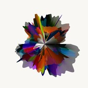 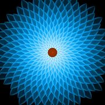  

_From left to right: **Fabio Catapano | Paru Raj | Humble-Novice**_ 

Thus we are going to create a flower-inspired artwork, and this with only five or six nodes! 
Without further ado, let’s get into it!

## Step by step creation with Coollab

Firstly we will add a `Disk` as the base shape for our flower. We can keep the default parameters. We will then apply several transformations to this disk in order to turn it into a flower.

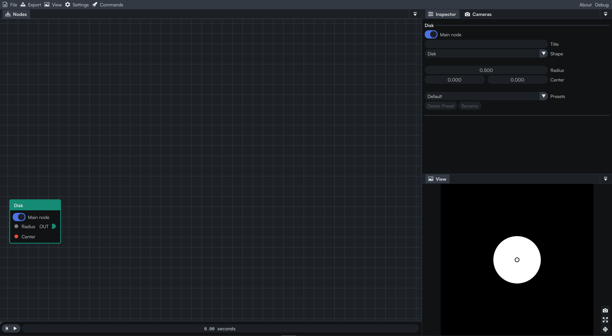

In order to have a repeating pattern, we will add a `Grid` node and link it to the previous `Disk` node. We now have a grid made of disks.

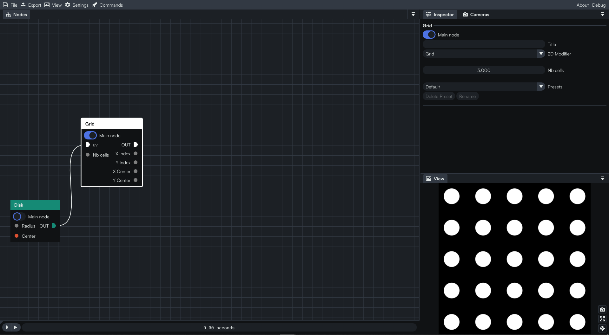

Next we are adding a `Mirror Repeat in Circle` node. By clicking and dragging our mouse on the `Period` slider in the  `Inspector` window we are able to modify the value. But if we want to be more accurate we can also <kbd>CTRL</kbd>+click on the slider and input the value of our choice. For our case, let’s put a negative value around -1.350. 
At this time, we have something which looks like a firework star! 🎆

Now is the time to build the petals! We can add the great `Kaleidoscope` node and… magic! We now have a flower-like shape in the center of the drawing! We can add more petals by increasing the number of `Splits`. We will stick with 6.

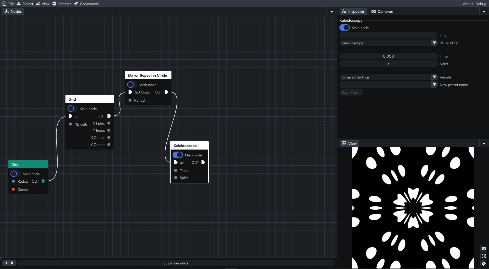

:::tip
If you accidentally moved inside the view panel, you can reset the position of the camera to the origin by clicking on the  button in the bottom right corner of the panel.

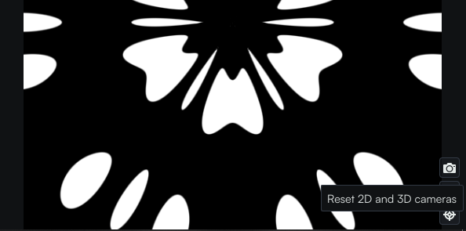
:::

You can zoom-in a bit in the view panel using the wheel of the mouse. Before scrolling in, press the <kbd>ALT</kbd> key in order to zoom with respect to the center of the view. 
This way you can adjust the render to keep only the flower and get rid of what is surrounding it.

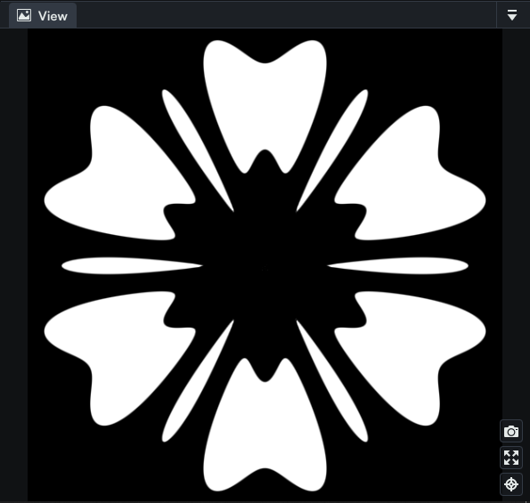

In the next step we will add a bit of glow to the image. To do so, let’s add a `Glow` node and adjust its `Strength` value to 0.008, a reasonable amount.

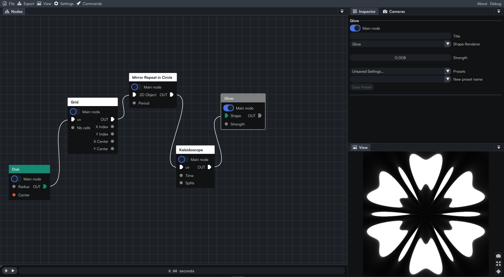

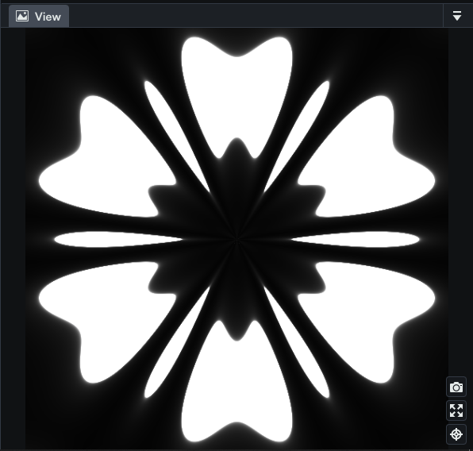

Black and white is fine, but let’s color our flower. We will add a `Color Ramp`.

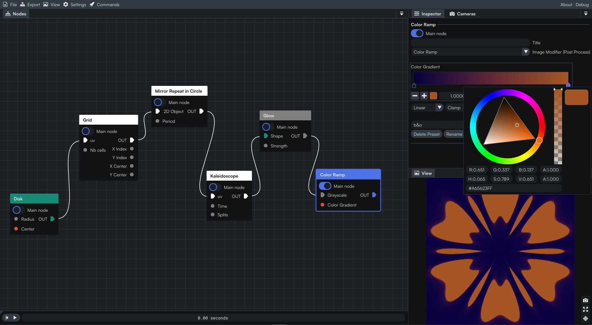

To change the color you can click on any marker in the `Color Gradient` bar, then on the colored square next to the `-` and `+` buttons. If you double-click on the marker, you will achieve the same result. You have access to a color panel with a wheel, and a slider for the alpha channel. You can also directly input and modify the color values.

:::tip
If you are happy with the configuration, you can give it a name and save it as a preset by clicking on `Save Preset`.

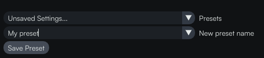
:::

We have an interesting result with the default Candy preset! 😄

## Export the artwork

When you are happy with the result from the view panel, we can go over to the  `Export` section in the menu bar and select the  `Image` option.

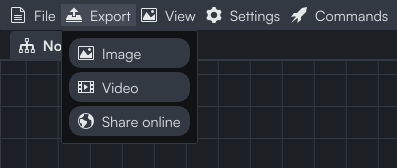

You can then choose the resolution and the aspect ratio of the image as well as the name and the path where your want to save your artwork.

:::tip
Note that you can go to &nbsp; **View > Fixed aspect ratio** in the menu bar to change the aspect ratio and preview what the image will look like, according to the chosen ratio, in the view panel.
:::

And well done! We have a beautiful flower!

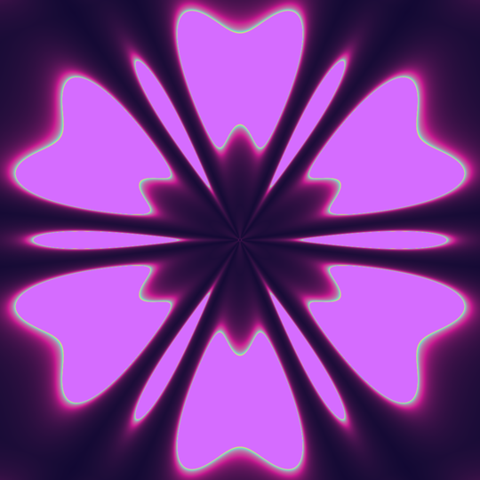

Here are some other examples we made using just a handful of nodes.

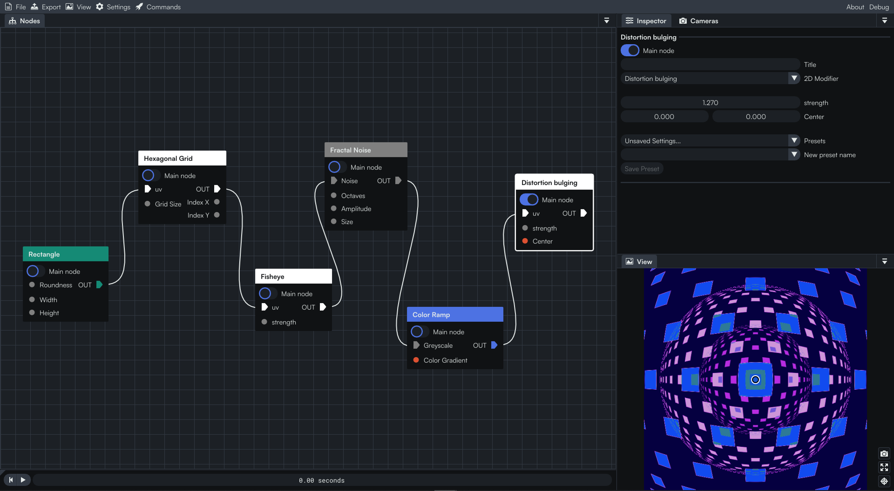

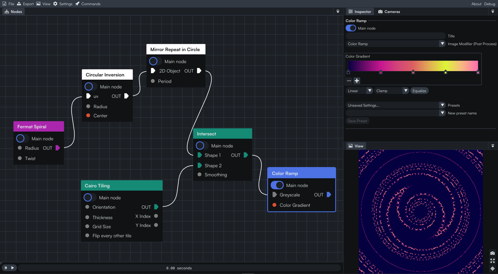

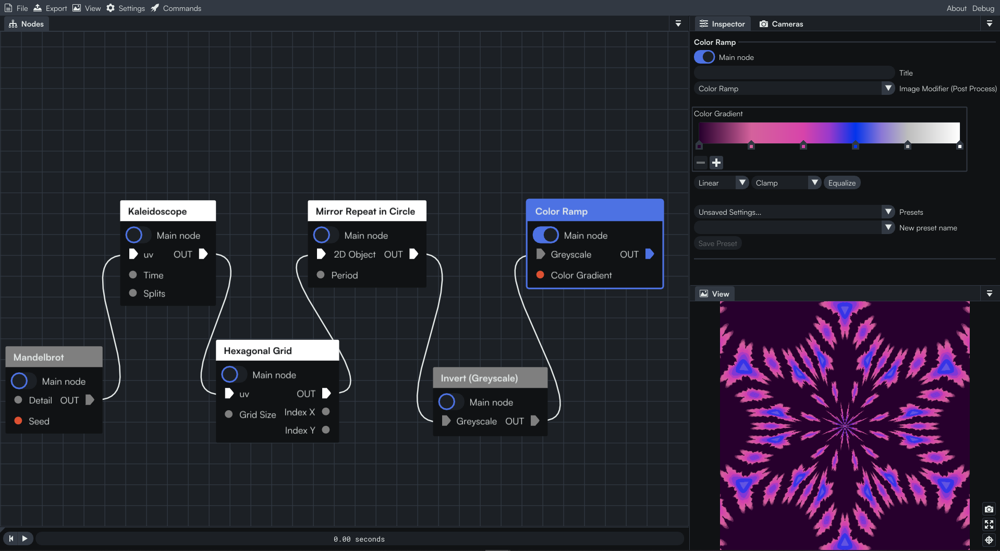

## End of the tutorial

This the end of this tutorial. It is now your turn to experiment and create your first artwork! Try to keep it simple at first, using no more than a couple of nodes 😉. 

Also, feel free to modify the example we have done together, play with different parameters and/or try to add new nodes to the existing graph.

See you in another tutorial of the Coollab discovery series! 👋