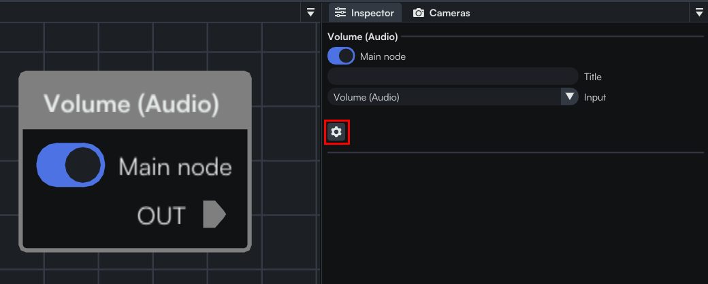
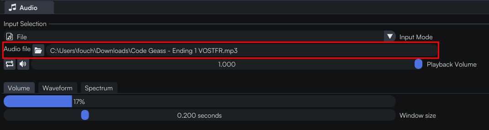
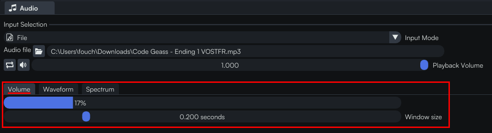
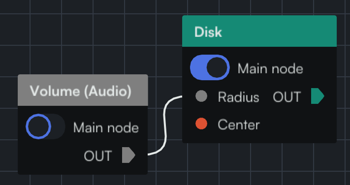
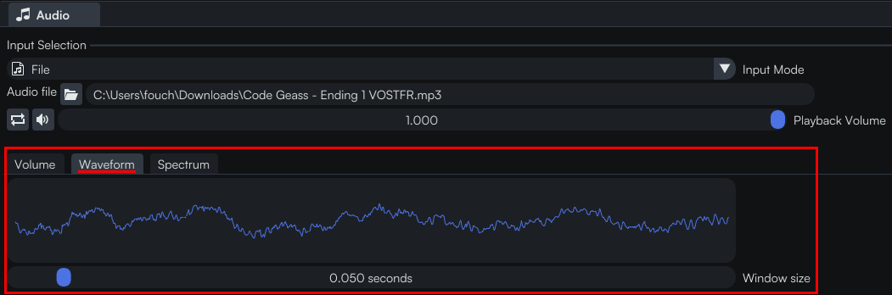
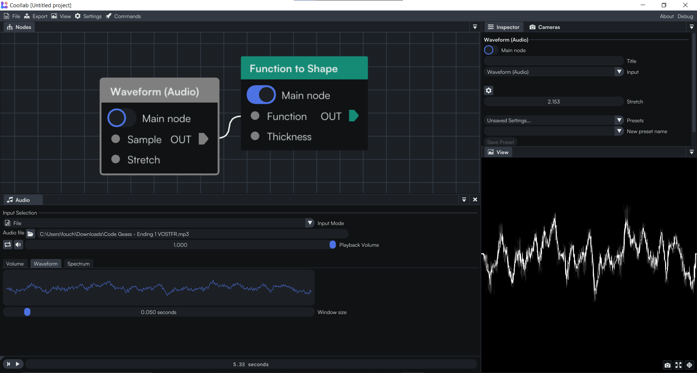
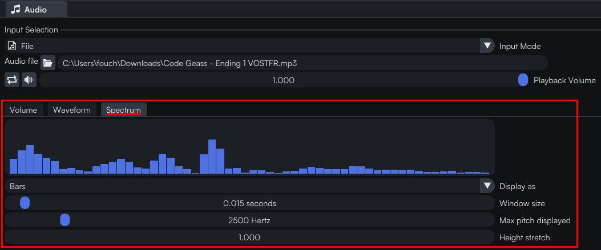
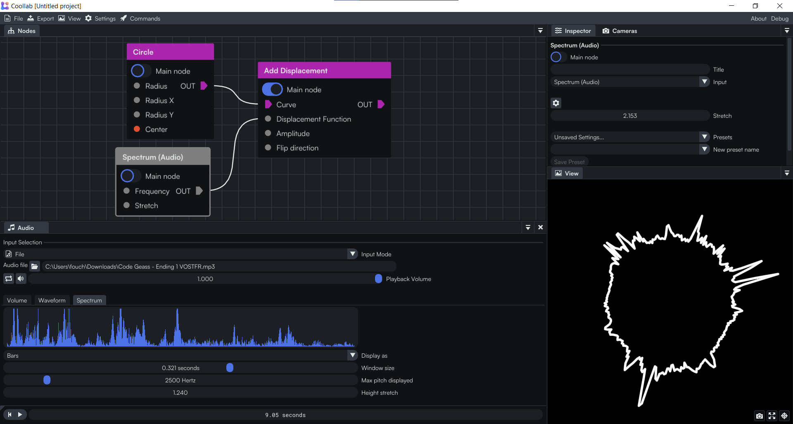

In Coollab you can make your effects react to audio!

In order to configure the audio, you need to open the  *Audio* config window, either from the  Commands palette:

or from the  cog button on audio nodes:

## Audio inputs

You can receive your audio either from a  `File` or from a  `Device` (microphone / audio stream).

### File

You can select any audio file from your computer (.mp3, .wav, *etc.*).

You then have a few options:
-  You can make the audio loop
-  You can mute the audio. This will not affect your audio-reactive nodes, it will just mean that the audio isn't played by Coollab. But your nodes will still consider that the audio is playing at full volume.
- You can control the *Playback Volume* of the audio. This will not affect your audio-reactive nodes, it will just affect the volume played by Coollab. But your nodes will still consider that the audio is playing at full volume.

### Device

You can either select *Use default device: xxx* and Coollab will automatically use your default device (e.g. the integrated microphone of your laptop, or the microphone that you have plugged in), and automatically switch when the default device changes (e.g. when you plug / unplug a microphone).

Or you can select a specific device, and Coollab will keep using this one, and give you an error if it becomes unavailable (e.g. your microphone gets unplugged).

You can then tweak the *Volume Amplifier* to make sure that the audio is well calibrated and is neither too low nor too loud.

## Audio features

You can configure each audio feature on the  *Audio* config window, and then receive their values from audio nodes in your graph.

### Volume

The *Window size* controls over how long of a section of the audio the volume will be averaged. A longer duration will result in smoother variations, but will be slower to compute.

You can then access it with the node "*Volume (Audio)*". It is a number that you will typically use to drive some parameters of your nodes:

### Waveform

The waveform is the raw amplitude of the audio signal, plotted over time.

The *Window size* controls how big of a section of the audio will be visualized at once. A longer duration will result in more apparent scrolling, but will better show the shape of the wave.

You can then access it with the node "*Waveform (Audio)*". You will typically visualize it as a function (with either "*Fill Function*" or "*Function to Shape*"), or apply it on top of a curve with "*Add Displacement*":

### Spectrum

The spectrum shows how much low and high pitches there is in your audio at the current time. (Low pitch on the left, high pitch on the right).

The *Window size* controls over how long of a section of the audio the spectrum will be averaged. A longer duration will result in smoother variations, but will be slower to compute.

You can then access it with the node "*Spectrum (Audio)*". You will typically visualize it as a function (with either "*Fill Function*" or "*Function to Shape*"), or apply it on top of a curve with "*Add Displacement*":

