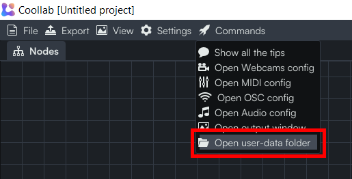
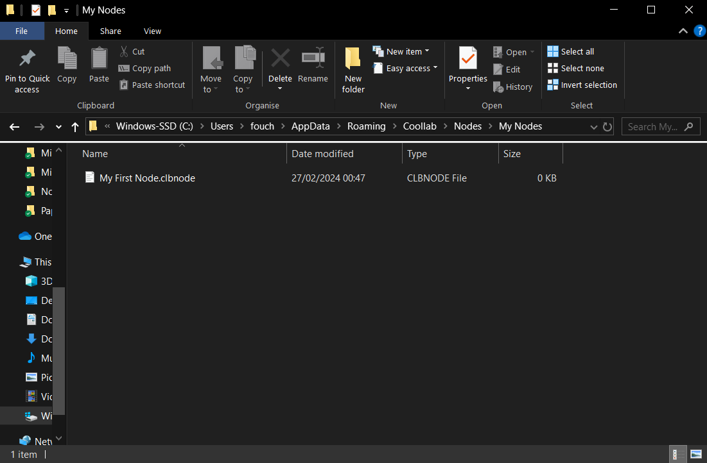

:::info
Please consider sharing your new nodes with us, and with your permission we might add them to Coollab 💜.<br/>

[Submission link](https://github.com/CoolLibs/Lab/issues/new?assignees=&labels=enhancement&projects=&template=add-node.yaml&title=%5BNew+node%5D+).
:::

Coollab nodes are tiny fragments of shader code written in glsl. If you don't know what this is you can start by [watching tutorials from The Art of Code](https://youtu.be/u5HAYVHsasc).

To create a new node:
- Open Coollab's user-data folder. You can do this by using the corresponding <span class="icon-rocket"></span> Command:


- In the *Nodes* folder add a new file with the *.clbnode* extension.
>You can also put it in a subfolder of *Nodes* to create a category with the same name as the subfolder. Or you can add it to an existing category of Coollab by naming your subfolder the same as one of Coollab's categories.<br/>
If you want to sort your categories, you can put numbers at the beginning of their name to force an order. These numbers will not be rendered in the category name.



- Open the file and start writing your node! Here is a very basic example that you can just copy-paste into your file:
```glsl title="Invert Color.clbnode"
sRGB main(sRGB Color)
{
    return vec3(1.) - Color;
}
```

All nodes need to have a function called `main`: this is what will be used to apply the effect on whichever node will be plugged into your node.<br/>
In Coollab a lot of implicit conversions and code generation happen behind the scene. This means that you can write minimal nodes and the rest will happen automagically. For example our `Invert Color` node takes a color and outputs a new color. If you plug a whole image into the `Invert Color` node, the `main` function you defined will be called on each pixel of the image, thus creating a new image with inverted colors. Notice that in our `Invert Color` node we never mentioned images, only colors, which is a simpler and smaller building block. This is great! Our nodes stay very simple and focused on what they want to achieve.

It is possible for the `main` function to have several inputs, *but they must all be of the same type*:[^1]

```glsl title="Add.clbnode"
float main(float x, float y)
{
    return x + y;
}
```

[^1]: If you have a use case where this limitation is annoying to you, feel free to [contact us](https://github.com/CoolLibs/Lab/issues/new?assignees=&labels=enhancement%2Ctriage&template=feature-suggestion.yaml&title=%5BFeature%5D+) and we will happily consider your use case and improve Coollab to make it fit your needs.

Also, it is possible that your `main` function doesn't take any input at all if it represents a constant:

```glsl title="Float Value.clbnode"
INPUT float 'Value';

float main()
{
    return 'Value';
}
```

:::tip
If you want to see more examples, you can check out [all of Coollab's nodes](https://github.com/CoolLibs/Lab/tree/main/Nodes).
:::