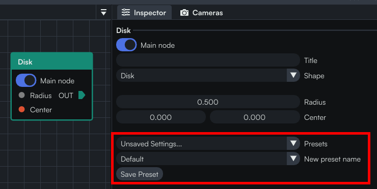

All the nodes have presets which allow users to quickly switch between different configurations, and save them.

You always need to define at least one preset for your node, called `Default`. Otherwise all the values of all the inputs will be 0 when a user creates a new node, which is rarely a good default.

:::info Important
When creating your Default preset you not only need to care about the values, but also the *metadata* (available by right-clicking on each widget). This will typically mean choosing a good default range for sliders, or specifying that a number cannot be negative.
:::

