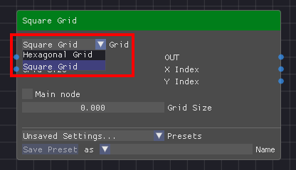
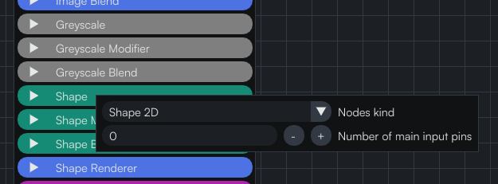

A category is defined by simply creating a folder with the desired name in the "Nodes" folder. All nodes belonging to that category will have to be put in that folder.

## Consistency between nodes of the same category

:::info
Since nodes of the same category can be swapped with each other, it is important to make sure they will be compatible. This is achieved by using the exact same parameter names when they share common parameters. For example both "Square Grid" and "Hexagonal Grid" have a "Grid Size" parameter. By giving it the exact same name in both nodes we make sure that its value / links will be preserved when switching between a square and hexagonal grid in the dropdown.
:::

## Category config

By right-clicking on a category in the nodes menu, you can configure its color. If you create a new category it is important to pick a color for it.

