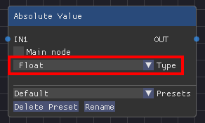

There is a special primitive type called `Any` that can be any type chosen by the user. This means that you will need to implement your node in a way that will work for both int, float, vec2, vec3 and vec4.

```glsl title="Absolute Value.clbnode"
Any main(Any x)
{
    return abs(x);
}
```

