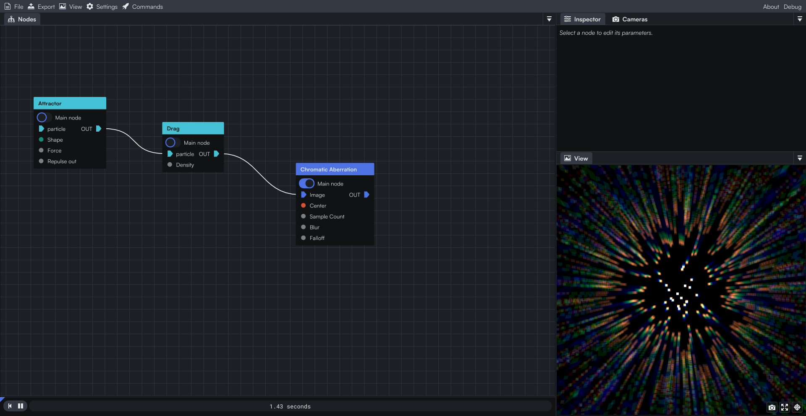

## Particle nodes

A Particle node is a special kind of node that holds a particle system. A node will share its particles with the next node connected to it, and each node will impact the particles in its own way through the GLSL code. They will move accordingly to the timer, although they do not retain any memory of their previous positions.

Once you plug a Particle to a normal node, the node will take in a normal image that contains whatever the Particle renders.



There are two kinds of Particles: 2D particles, and 3D particles.

<div style={{display: "flex", justifyContent: "space-between", gap: "1rem"}}>
    <div style={{width: "100%"}}>

```glsl title="Particles in 2D"
struct Particle2D {
    vec2  position;
    vec2  velocity;
    vec2  acceleration;
    float size;
    float lifetime;
    float lifetime_max;
    float age;
    vec4  color;
};
```

</div>
<div style={{width: "100%"}}>

```glsl title="Particles in 3D"
struct Particle3D {
    vec3  position;
    vec3  velocity;
    vec3  acceleration;
    float size;
    float lifetime;
    float lifetime_max;
    float age;
    vec4  color;
};
```

</div>
</div>

You will notice that the two are very similar, with the only difference being whether they're 2D or 3D. In fact, you will also notice that all currently available nodes are the same in 2D or in 3D.  
In practice, this means that if you make a Particle node in one space, it shouldn't be too hard to port it to the other space.

```glsl title="Gravity 2D"
INPUT float 'Gravity';
INPUT Direction2D 'Direction';

Particle2D main(Particle2D particle)
{
    particle.acceleration += normalize('Direction') * 'Gravity';
    return particle;
}
```
```glsl title="Gravity 3D"
INPUT float 'Gravity';
INPUT vec3 'Direction';

Particle3D main(Particle3D particle)
{
    particle.acceleration += normalize('Direction') * 'Gravity';
    return particle;
}
```

## Particle scripting

But of course, you probably don't want to write the same code twice. That would be tedious and prone to errors. 

Instead, we offer a special kind of nodes that are meant to write the code once and transpile it into two nodes, the 2D one and the 3D one.

There is a little python script named `generators.py` in the particles folder, that will scan all nodes such as the following inside the `input` folder, and will generate the above nodes in `Particle 2D` and `Particle 3D`.

<!-- TODO(Particles) Screenshot from Windows 10/11 of "coollab/Nodes/80 Particle/" -->

```glsl title="Gravity.clbtemp"
INPUT float 'Gravity';
INPUT $Direction 'Direction';

$Particle main($Particle particle)
{
    particle.acceleration += normalize('Direction') * 'Gravity';
    return particle;
}
```

The important element is those dollar variables like `$Particle`. These are special key words, meant to be replaced by their 2D or 3D counterparts.

### A list of the key words

| Template     | 2D            | 3D           |
|--------------|---------------|--------------|
| `$vec`       | `vec2`        | `vec3`       |
| `$vec23`     | `vec2`        | `vec3`       |
| `$vec34`     | `vec3`        | `vec4`       |
| `$UV`        | `UV`          | `vec3`       |
| `$Point2D`   | `Point2D`     | `vec3`       |
| `$Direction` | `Direction2D` | `vec3`       |
| `$Particle`  | `Particle2D`  | `Particle3D` |

### Macros

Sometimes, you also want to define those vectors, or to use more specific implementations depending to the dimensions. That is why you also have access to macros.  
Consider the followings

```glsl title="Set Lifetime.clbtemp"
INPUT float 'Lifetime';

$Particle reset($Particle particle)
{
    particle.lifetime     = 'Lifetime' * hash_0_to_1_2D_to_1D(particle.position.xy);
    particle.lifetime_max = particle.lifetime;
    particle.velocity     = $vec(0);
    particle.size         = 0.5;

$$if(IS_3D)
    particle.position = hash_0_to_1_3D_to_3D(vec3(_time, 0, 0)) * 2 - 1; // -1.0 to 1.0
$$else
    particle.position = hash_0_to_1_2D_to_2D(vec2(_time, 0)) * 2 - 1; // -1.0 to 1.0
$$endif

    return particle;
}

$Particle main($Particle particle)
{
    particle.lifetime -= _delta_time;

    if (particle.lifetime <= 0.0)
    {
        particle                 = reset(particle);
        coollab_context.particle = particle;
    }

    return particle;
}
```

The key words `$$if(IS_3D)`, `$$else` and `$$endif` are macro functions, here to tell the script whether your block of code should appear or not, accordingly to the type of Particles you're dealing with.  
You can also use `$$if(IS_2D)`.

That way, you can define a function which's implementation is quite different in 2D or in 3D.

### Procedurally generated functions

Admitedly, some function are quite commonly used, enough so that we would make them available so that you don't have to rewrite them. A good example is the gradient function (which is the variations of a Signed Distance Function).

```glsl
vec2 gradient(vec2 p)
{
    float h = 0.001;
    return vec2(
               'Shape'(p - vec2(h, 0)) - 'Shape'(p + vec2(h, 0)),
               'Shape'(p - vec2(0, h)) - 'Shape'(p + vec2(0, h))
           )
           / (2. * h);
}
```

So, you can call `$gradient(p, 'Shape')`, like in the following:

```glsl title="Attractor.clbtemp"
INPUT $UV->SignedDistance 'Shape';
INPUT float 'Force';
INPUT bool 'Repulse out';

$Particle main($Particle particle)
{
    float force = 'Force';
    if ('Shape'(particle.position) < 0)
    {
        force *= 'Repulse out' ? -1. : 0;
    }
    particle.acceleration += $gradient(particle.position, 'Shape') * force;
    return particle;
}
```

And you can also call the function multiple times with different inputs in it.
```glsl
INPUT $UV->SignedDistance 'Shape 1';
INPUT $UV->SignedDistance 'Shape 2';
$Particle main($Particle particle)
{
    // ...
    $gradient(particle.position, 'Shape 1');
    $gradient(particle.position, 'Shape 2');
    return particle;
}
```
