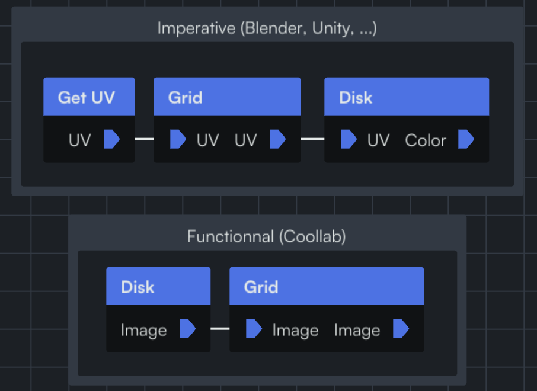

https://linktr.ee/coollab_art

Coollab is a node-based generative-art software where you compose small building blocks to create great artworks. It shares a few similarities with TouchDesigner, NotchVFX and the likes. But unlike any software that we are aware of, Coollab takes a much higher-level approach, inspired by functional programming. The main design guideline of Coollab is to have a very low barrier to entry, to be very intuitive even to people with little to no knowledge in programming or mathematics. While at the same time making it very easy for people who know shader programming to add their own effects and nodes to the software.

## On the user side

DISCLAIMER: if you are not familiar with shader-based art, some details of the following discussion might be hard for you to grasp. You can learn the basics with / everything you need with: [TODO mettre la vidéo de kishimisu si elle est bien]

Here is an example of an artwork made with Coollab:
[TODO refaire cette image en aillant les bons noms d'inputs sur les nodes + avoir le dernier node en main node]

.png)

As you can see, the graph is very declarative: you start with a shape (`Disk`) and then apply several effects on top of it (`Kaleidoscope`, `Zoom`, etc.).

What allows us to be that declarative is that we do not pass *data* between nodes, but *functions*. Each node receives a function (the previous node) and decides when to call it, with which parameters, and what to do with the output. This allows us to have more freedom when implementing nodes, which allows us to abstract more details away from the user.

[TODO image d'une grille de disques]
For example, if we want to make a grid of disks, we first need to have a function that creates a disk[^1], and then modify it's input to make it tile by using a `modulo` (cf. https://youtu.be/svLzmFuSBhk?t=235)

[^1]: Since we use a shader-based workflow, this is done by having a function that takes a position in space (called UV) and returns a color (white if we are inside the disk, black if we are outside).

So a data-oriented workflow like we can find in Blender or Unity would look like this: we first get the position (UV), then modify it with a Grid node, then pass it to the Disk node.

[TODO première partie de l'image, avec Imperative renommé en Data-Oriented]

On the other hand, in Coollab you first create your Disk, and then pass that function to the Grid node, which will call it with a modified position.

In Coollab, it's not the data that flows in the links! Each node receives functions and decides in which order things are called, which abstracts away these details for the users. Note that Coollab's nodes don't take UVs, but Images (aka *functions* that map each UV to a Color).
Also, the order is inverted, and we believe Coollab's order is more intuitive for people who have no idea of what happens under the hood. (e.g. another effect, that modifies the output (eg. Color->Color) is applied the same in Coollab, but in a different order in Blender. For a user, they don't know why the Grid effect should be different from the Contrast effect.)

[Show fractal noise and the higher-order function approach: passing a noise function to the fractal noise node + this allows creative uses: people passing photos in there and having a nice repetition effect] 

## Behind the curtain

[Montrer l'implem de qques nodes, à quel point c'est simple et on se concentre sur le code de l'effet, 0 boilerplate, le logiciel gère les conversions etc.]

## Conclusion

You can download it and try it for yourself: https://coollab-art.com/