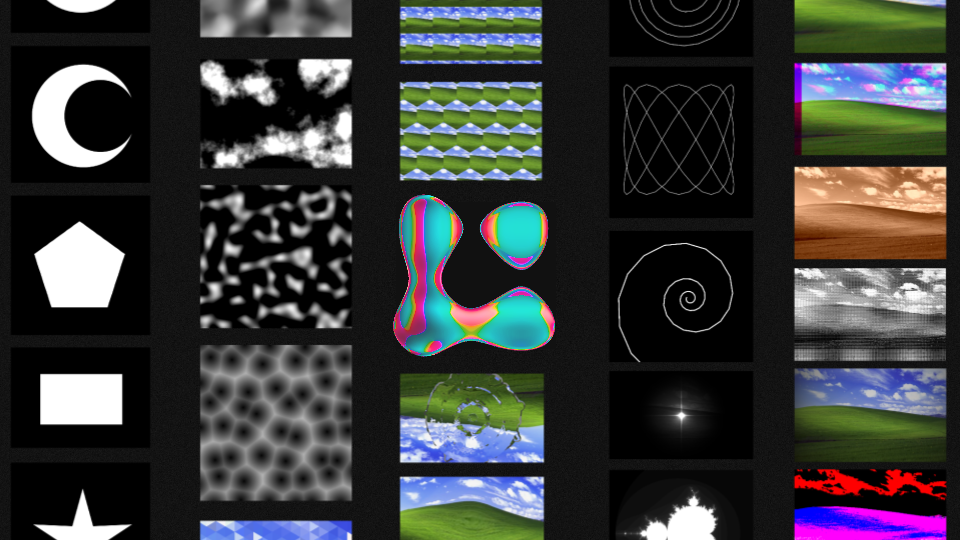
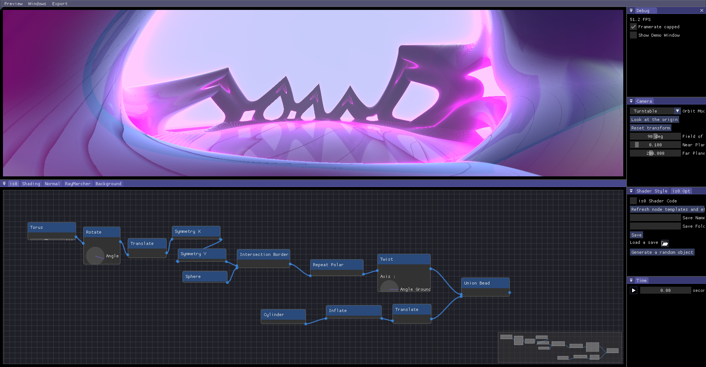

import LabGallery from "@site/src/components/LabGallery"
import YoutubeVideo from "@site/src/components/YoutubeVideo"
import SponsorUs from "@site/src/components/_SponsorUs.md"
import Download from "@site/src/components/_Download.md"

_❝ CoolLab is a generative art software that gives you **powerful tools** and the power to **customize these tools** and **create new ones**.❞_

<!-- _❝ Composition is at the heart of every good system.❞_

_❝ Resolution-independent.❞_

_❝ Infinitely large and infinitely detailed images. Our images are maps from the entire plane ($\mathbb{R}^2$) to colors.❞_ -->

<Download/>

<b> Follow us on Instagram <a href="https://www.instagram.com/coollab_art/">@coollab_art </a></b>

<!--  

<b> Follow us on TikTok <a href="https://www.tiktok.com/@coollab_art">@coollab_art </a></b>

  -->

 

<SponsorUs/>

<LabGallery/>

## Trailer

<YoutubeVideo id="dutYmhGqhxM"/>

## What is _CoolLab_?

We want to build a software geared towards generative art and easily accessible. We also make our whole underlying technology available to other developers and easily reusable in the form of a framework: [_Cool_](https://github.com/CoolLibs/Cool).

The goal of _CoolLab_ is both to have a software that uses _Cool_ so that we can work on the framework, but also to develop a genuinely cool software for artists and programmers.

<!-- My personal goal is to be able to produce abstract music videos with it.  -->

This project is still in the early phases of development, but you can already obtain cool results with it!

**_is0_, our node-based _Constructive Solid Geometry_ modeler:**

## Who are we?

A group of programers who love making art. Since we are stubborn and ambitious we decided to build the software of our dreams, from scratch.

## What's in the name?

_CoolLab_ is a place to experiment, a _Lab_. This refers both to the exploratory nature of generative art, and the fact that by building this software we want to push the limits of software engineering and build the software of the future, using the lessons of the past decades in software development. Enter C++ 20, modules, functional programming, a decoupled architecture, and many more cool stuff!

_CooLab_ is also a pun on _collaboration_, reflecting our open-source nature and our desire to share knowledge and tools and build something grand together.